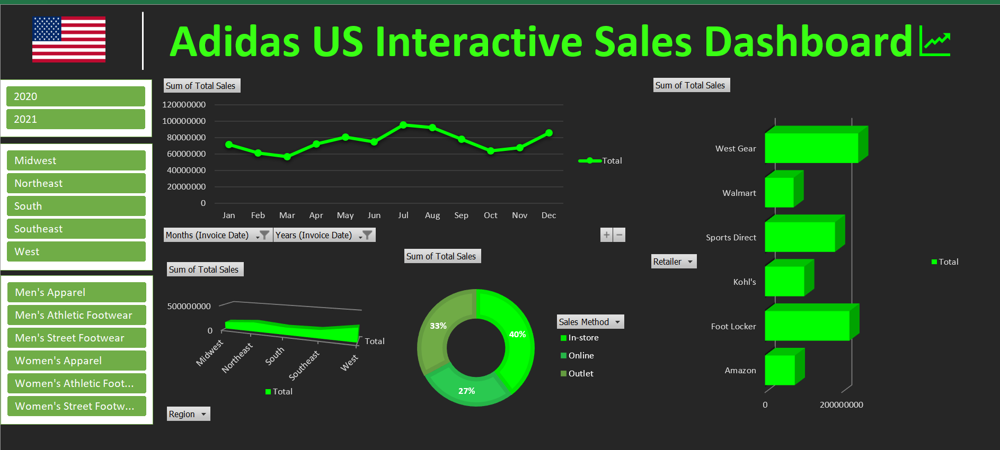

# Adidas Sales Dashboard Analysis (Excel)

## 📊 Project Overview

This project analyzes Adidas sales data to identify key trends in revenue, product performance, regional sales, and sales methods. A dynamic Excel dashboard was created to visualize business performance and provide actionable insights.

## 🎯 Objective

* Analyze Adidas sales dataset
* Identify top-performing regions and products
* Understand sales trends across different channels
* Build an interactive Excel dashboard

## 🛠 Tools & Technologies

* Microsoft Excel
* Pivot Tables
* Data Visualization
* Dashboard Design

## 📁 Dataset

The dataset includes sales data such as:

* Product categories
* Retail regions
* Sales methods
* Revenue figures

## 📈 Analysis Conducted

* Regional sales performance analysis
* Product category performance
* Sales trends by sales channel
* Revenue comparison across regions

## 📊 Dashboard Preview

*(Add dashboard screenshot here)*

## 💡 Key Insights

* Certain regions contribute the majority of total sales.
* Specific product categories generate higher revenue.
* Sales through particular channels outperform others.

## 📂 Repository Structure

dataset/
adidas_sales_data.xlsx

dashboard/
dashboard.png

README.md

## 🚀 Skills Demonstrated

* Business Data Analysis
* Excel Dashboard Creation
* Data Visualization
* Pivot Table Reporting

## 📌 Conclusion

This dashboard provides a clear overview of Adidas sales performance and highlights important business insights through effective visualizations.
